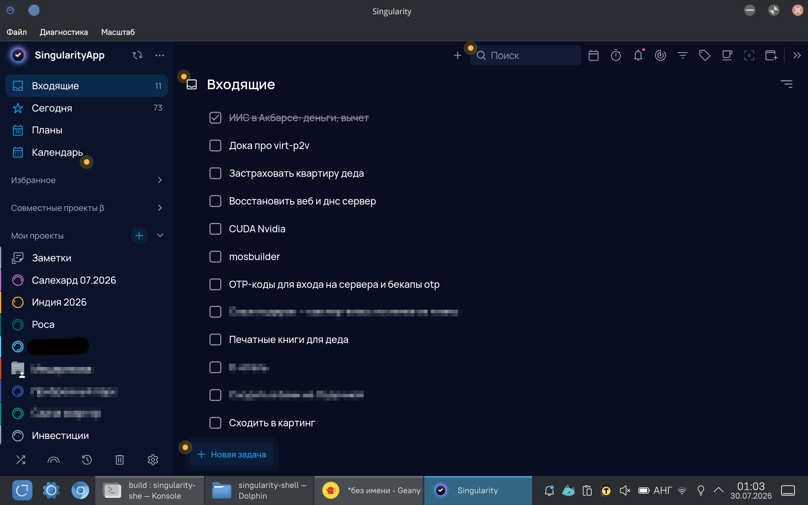
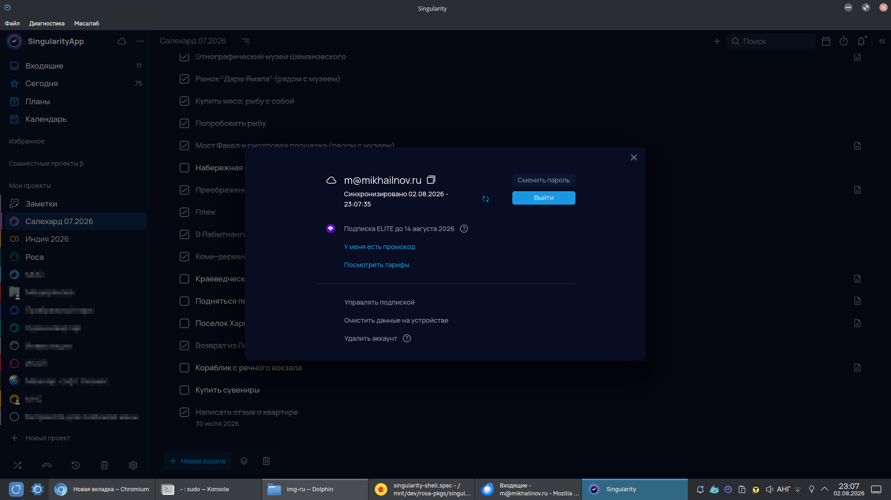
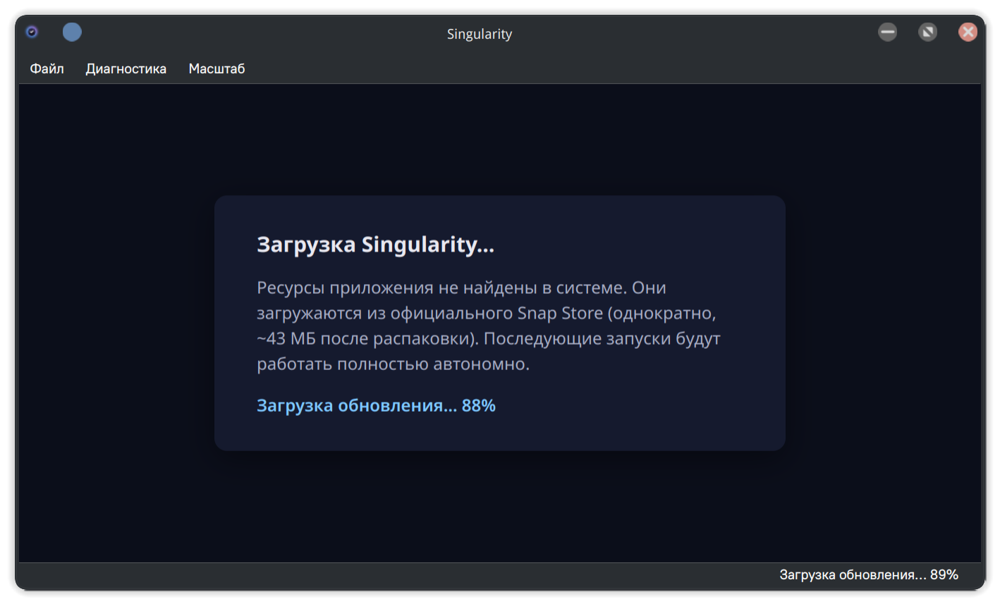
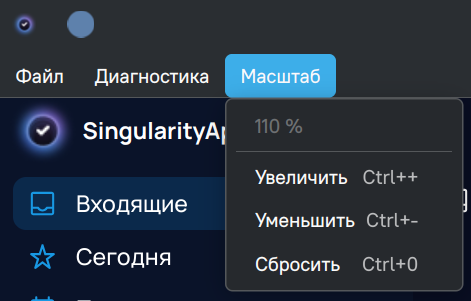
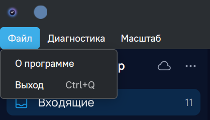
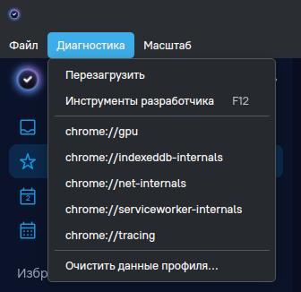
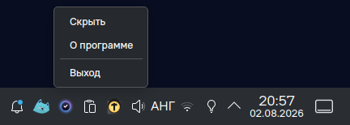

# singularity-shell

Unofficial desktop **QtWebEngine** application for [Singularity](https://singularity-app.com/) task manager.

Their official application is Electron-based and is distributed only via Snap store.

This unofficial application uses system QtWebEngine and can be built from source and be installed from distro repos.

The offline javascript version from the Snap package is reused.













When hidden to tray, JavaScript execution is frozen — **~0% CPU** load, instant resume when restored from tray!



## Installation

### ROSA Linux, MOS/MosTech.OS

On ROSA 13+: `sudo dnf install singularity-shell`

RPM packaging sources: https://abf.io/import/singularity-shell

### Building from source

Install devel parts of Qt and QtWebEngine.

```bash
mkdir build
cd build
cmake ..
make -j$(nproc)
./singularity-shell
```

## How it works

The vendor's own Electron client runs the whole app on a privileged custom
origin `sg://renderer` served from local files. This shell replicates exactly
that with `QWebEngineUrlScheme` + `QWebEngineUrlSchemeHandler`: the shell
origin is always "online" because it comes from disk, so **cold start works
offline**; sync and auth go cross-origin to the vendor's cloud (their API
answers `Access-Control-Allow-Origin: *`) exactly as in the official client.

- Baseline assets may be shipped at `/usr/share/singularity-shell/` →
  first launch works offline out of the box.
- A **silent background updater** checks the Snap Store once a day, downloads
  newer assets into `$XDG_DATA_HOME/singularity-shell/assets/` (SHA3-384
  verified), and stages them via an atomic symlink switch — active **on the
  next start**. Disable with `--no-auto-update`.
- All app state (cookies, IndexedDB, service workers) lives in a persistent
  `QWebEngineProfile` under `$XDG_DATA_HOME/singularity-shell/profile/`.

### Known issues

- **Print (Ctrl+P)**: printing the daily plan does not work (see `docs/printing.md`).

## Diagnostics

### Developer tools

**Diagnostics → Developer tools** (or the **F12** key) opens Chromium DevTools
for the current page: Console, Network, Application (service workers,
IndexedDB, cookies), Sources. Works in both the main window and popups. For an
external browser: `QTWEBENGINE_REMOTE_DEBUGGING=9222 singularity-shell`, then
open `http://localhost:9222`.

### Network request logging

The environment variable **`SINGULARITY_SHELL_LOG_REQUESTS=1`** enables verbose
logging of every network request to stderr — on top of the working CORS fix
(unlike `--diagnose`):

```bash
SINGULARITY_SHELL_LOG_REQUESTS=1 singularity-shell 2>&1 | grep -E '\[net\]|\[sg-proxy\]'
```

- `[net] <type> <method> <URL>` — every intercepted request (no HTTP status: the
  interceptor runs before the response is received);
- `[sg-proxy] <method> <URL>` and `[sg-proxy] HTTP <status> (<ok|error>) <URL>` —
  proxied requests (e.g. subscribing to an iCal calendar) **with status**;
- `[sg-proxy] refused non-vendor host…` — proxy-relay refusal (SSRF protection),
  logged unconditionally.

These lines make it easy to see, for example, that an iCal request goes through
the `sg://` relay while other requests go direct.

### Other

- `--diagnose` — a separate logging-only interceptor (observation only; disables
  the `deadline` CORS fix, so cloud calls may fail — prefer the env var above for
  network debugging).
- `--no-auto-update` — disable the background updater.
- `--probe` — dump page state (service workers, IndexedDB) 20 s after start,
  then quit (debug aid).

## Architecture: converting an Electron app to QtWebEngine

This section is written as a reusable reference for anyone attempting a
similar conversion. It covers the general pattern, the vendor-specific
reverse-engineering process, and every non-obvious hack that was required.

### The general pattern

An Electron desktop app typically consists of:

1. A **custom URL scheme** (`sg://renderer` in this case) served from a
   local directory — this is the whole application UI.
2. A **preload script** injected into every page that exposes desktop
   capabilities (`window.preloadApi`) via `contextBridge`.
3. Cloud API calls made cross-origin from the custom scheme to the
   vendor's servers.

To replicate this with QtWebEngine you need:

| Electron concept | QtWebEngine equivalent |
|---|---|
| `protocol.registerSchemesAsPrivileged` | `QWebEngineUrlScheme::registerScheme` |
| `protocol.handle` | `QWebEngineUrlSchemeHandler` |
| `contextBridge.exposeInMainWorld` | `QWebEngineScript` at `DocumentCreation` + `QWebChannel` |
| `BrowserWindow` | `QMainWindow` + `QWebEngineView` |
| Persistent `session` | Named `QWebEngineProfile` + `setPersistentStoragePath` |
| `autoUpdater` | Custom `UpdateController` querying Snap Store API directly |

### Reverse-engineering the vendor's preload API

The most labor-intensive part is replicating the `window.preloadApi` surface.
The approach:

1. **Download the vendor's snap** via the public Snap Store API (no snapd
   needed — the `.snap` is just a SquashFS archive).
2. **Extract `resources/app.asar`** (Electron archive format) using a
   purpose-built tool (`tools/asar-extract.cpp` — dependency-free, ~200
   lines of C++).
3. **Read `build/main/preload.js`** — this is the vendor's preload script.
   It defines a class that creates controller objects via an `ipcService`
   helper. Every controller name and method signature must be matched.
4. **Grep `build/js/app.bundle.js`** for `preloadApi.` call sites to
   confirm which controllers and methods are actually called at runtime.

The vendor's preload structure (reverse-engineered from v12.6.0):

```
preloadApi
├── ipcRenderer          { send, on, off }
├── isPopup              bool
├── windowController     { minimize, maximize, close, isMaximized, getId,
│                          isVisible, isFocused, isFullScreen, hide, show,
│                          focus, blur, setAlwaysOnTop, moveTop,
│                          setFullScreen, OPEN_NEW_WINDOW, … }
├── zoomController       { ZOOM_IN, ZOOM_OUT, ZOOM_RESET }
├── urlController        { openExternal, openPath, supportsOpenPath }
├── appController        { QUIT_APP, RESTART_APP, … }
├── fetchController      { fetch }          ← proxies to native fetch()
├── updateController     { checkUpdates, applyUpdateAndRestart }
├── menuController       { TOOLBAR_UPDATED, POPUP_MENU, … }
├── popupController      { open, close, sendResult, … }
├── …and ~10 more controllers (all stubbed)
└── windowRenderToMainBridge  ← spreads windowController + adds
     addListener(), getPosition(), getBounds(), id
```

### Hacks and gotchas

#### 1. `sg://` scheme MUST NOT be "local"

Setting `LocalScheme | LocalAccessAllowed` on the custom scheme treats it
like `file://` — Chromium forbids ANY fetch/XHR to remote http(s) origins.
Every cloud API call fails instantly with `TypeError: Failed to fetch`
**before** CORS, before any packet is sent. Nothing appears in DevTools
Network. This killed all sync traffic and was extremely hard to diagnose.

Correct flags: `SecureScheme | ServiceWorkersAllowed | CorsEnabled |
FetchApiAllowed` — exactly what the vendor's Electron code uses.

#### 2. Vendor gRPC-web `deadline` header

The vendor's gRPC-web client sends a custom `deadline` header. Their nginx
CORS preflight response does NOT include it in `Access-Control-Allow-Headers`
(true for ALL origins, including the official web client). The Electron
desktop client avoids this by issuing API calls from the main process (Node
axios, no CORS). Our renderer has neither.

Fix: `VendorApiInterceptor` removes this one header for hosts under
`*.singularity-app.com/.ru` before CORS evaluation. Surgical — no
`--disable-web-security`. The header is only an advisory client-side timeout
hint, semantically safe to drop.

#### 3. QWebChannel argument serialization requires explicit String() cast

When calling a C++ slot via QWebChannel's JS proxy, the argument must be
an **explicit** JavaScript String. Passing a variable that holds a string
(even if `typeof` says `"string"`) may produce an empty call on the C++
side. Always use `b.slotName(String(jsVariable))`.

#### 4. Each window needs its own PreloadBridge instance

The PreloadBridge emits signals (minimizeRequested, closeRequested, etc.).
A single bridge shared across multiple windows causes signal cross-
contamination: minimizing one window would toggle all of them. Each
`createWindow()` popup creates a fresh `PreloadBridge` parented to its
`QWebEngineView`.

#### 5. `windowRenderToMainBridge` must spread windowController

The vendor's `windowBridgeFactory` spreads ALL windowController methods
into the bridge object plus adds `getPosition()`, `getBounds()`,
`addListener(channel, cb)`, and `id`. The app accesses these through
`this.provider.window.focus()` etc. A bare `{send, on}` stub causes
`TypeError: e.addListener is not a function`.

#### 6. Service Worker + custom schemes

The vendor's SW registers on `sg://renderer` and intercepts fetch events
for the shell origin. Validated: after first launch the SW is active and
IndexedDB contains `AppDatabase` + `SingularityLogs3`; both persist across
restarts. For local file serving the SW intercept is pure overhead, but
**do not unregister it** — the SW also manages the offline sync queue.

#### 7. OAuth popups need in-app handling

Login flows redirect through `accounts.google.com`, `appleid.apple.com`,
`login.microsoftonline.com`. These MUST stay in-app (share cookies via the
persistent profile) for `window.opener`-based auth completion. All other
external URLs open in the system browser via `acceptNavigationRequest` →
`QDesktopServices::openUrl`. Popups created for `target=_blank` links
auto-close after delegating to the system browser.

#### 8. `QJsonDocument::fromVariant(QString)` produces invalid JS

Used for injecting status text into the bootstrap page. A bare
`QJsonDocument::fromVariant(text)` on a QString produces a null document
in some Qt versions; `toJson()` then returns empty, creating broken
`<script>` content. Fix: wrap in `QVariantList{QVariant(text)}` → produces
`["properly escaped text"]` → strip brackets.

#### 9. Qt's `qt_standard_project_setup()` overwrites hand-edited .ts files

When `LinguistTools` is in `find_package`, `qt_standard_project_setup()`
auto-discovers `.ts` files in `translations/` and runs `lupdate`,
overwriting hand-edited translations with empty templates. Fix: store
`.ts` files in a non-standard directory (`i18n/`).

#### 10. Hide vendor's in-app window controls

The vendor's Electron window is frameless and draws its own minimize /
maximize / close buttons in the web content (class `.win-top-panel`).
Since Qt provides native window decorations, these in-app controls are
redundant and waste vertical space. A single CSS rule injected at page
creation hides them: `.win-top-panel { display: none !important; }`.

#### 11. System tray with JavaScript freeze

A full Chromium renderer running the vendor's JavaScript consumes CPU
even when idle (timers, service workers, sync polling). Cold start is
also slow — several seconds to load the SPA and re-register the SW.

Solution: a system tray with `QWebEnginePage::LifecycleState::Frozen`.
When the window is closed or hidden to tray (Ctrl+W), the page is
frozen — all JS execution stops, CPU drops to ~0%, memory is retained.
Restoring the window calls `LifecycleState::Active` — the page resumes
instantly, no reload needed.

The `--start-hidden` CLI flag starts the app minimized to tray — the page
loads in background.  The window is shown and immediately hidden on the next
event-loop tick (`QTimer::singleShot(0, hide)`) — this gives the WebEngine
view real screen geometry (so the SPA renders the desktop layout, not mobile)
without any visible flash.  After 12 seconds the page is frozen, ready for
instant restore.

On GNOME without a tray extension the app falls back to normal quit
behavior.

## Features

### Theme-aware background

On startup the page background matches the system color scheme:

dark `#1a1a2e` or light `#f0f0f5`. Changes live when the user switches
the system theme (`QStyleHints::colorSchemeChanged`). Eliminates the
jarring white flash before app content loads.

### Zoom persistence

Zoom level (Ctrl+= / Ctrl+- / Ctrl+0) is saved to
`~/.local/share/singularity-shell/settings.conf` and restored on the
next launch. The **Zoom** menu in the menu bar shows the current zoom
percentage and offers Zoom In / Zoom Out / Reset actions.

Keyboard shortcuts are handled via `eventFilter` on the
`QWebEngineView` — Chromium's internal key handling intercepts
`QShortcut` and `QAction` shortcuts at a lower Qt level.

### System tray with JavaScript freeze

Closing or hiding the window (Ctrl+W) minimizes to the system tray and
freezes JavaScript — CPU drops to near zero. Clicking the tray icon
or choosing **Show** restores the window instantly, with the page
exactly as it was left. No reload, no delay.

## Code layout

```
src/            C++ application (see qt-tz.md §6.1)
tools/          asar-extract.cpp — dependency-free asar unpacker (tested)
scripts/        fetch-assets.sh — snap → verified assets, no snapd (tested)
resources/      bootstrap page (first-run fallback, FR-10)
packaging/      .desktop file, RPM spec
i18n/           Russian translations (Qt Linguist)
docs/           printing.md — why plan-of-the-day print does not work
```

## Data locations
| Path | Content |
|---|---|
| `/usr/share/singularity-shell/assets/` | Baseline assets from the RPM (read-only) |
| `~/.local/share/singularity-shell/assets/` | Background-updated assets (versioned, `current` symlink) |
| `~/.local/share/singularity-shell/profile/` | Cookies, IndexedDB, SW, cache |
| `~/.local/share/singularity-shell/settings.conf` | UI state, zoom, updater timestamps |

## Contributing

Bug reports, patches, and pull requests are welcome via
[GitHub Issues](https://github.com/mikhailnov/singularity-shell/issues)
or email: [m@mikhailnov.ru](mailto:m@mikhailnov.ru).

[Russian README (Русский)](README.md)
